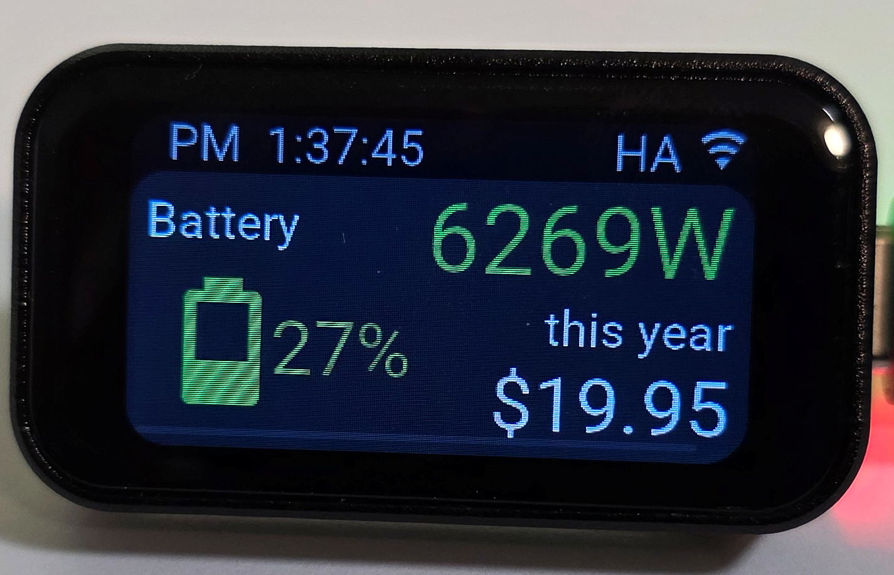
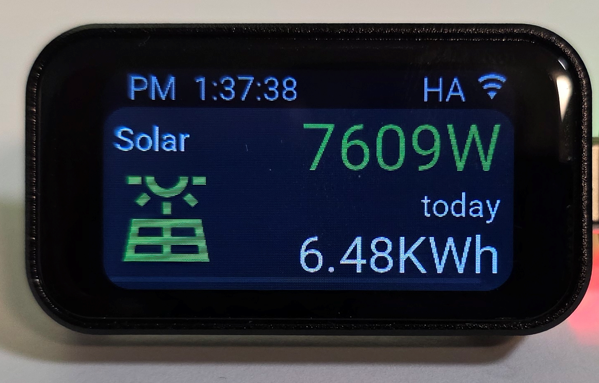

# ha_waveshare_esp32_c6_touch

This is the example of the dashboard that I made to see my solar production and house consumption on Waveshare 1.47 [ESP32-C6-LCD-1.47](https://www.waveshare.com/product/arduino/boards-kits/esp32-c6/esp32-c6-touch-lcd-1.47.htm) 
The case for the display is 3D printed based on [amduck design](http://thingiverse.com/thing:7065147) 

It shows 2 screens:
* Battery state
* Solar production

 
 

 

The ESP32-C6-LCD-1.47 display config is based on the work of [multiple people from home-assistant user forums](https://community.home-assistant.io/t/help-needed-to-get-this-tiny-screen-working-esp32-c6-1-47in-display) 
